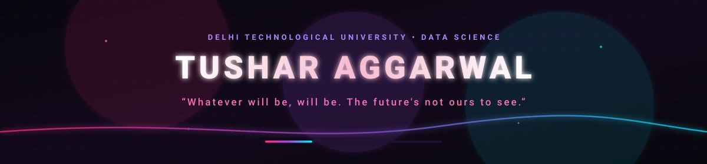

<div align="center">

<!-- Animated neon header -->


<br/>

<a href="https://github.com/biney25">
  
</a>

<br/>

<!-- One Dexter image/GIF -->


<br/><br/>

<a href="https://github.com/biney25">
  
</a>
<a href="https://github.com/biney25?tab=followers">
  
</a>
<a href="https://github.com/biney25?tab=repositories">
  
</a>

</div>

---

## 🩸 `> whoami`

```text
Name       : Tushar Aggarwal
GitHub     : @biney25
Based in   : Delhi, India
University : Delhi Technological University
Program    : Integrated B.Sc. + M.Sc. in Data Science
Current    : Year 1 · Semester 1
Mindset    : Learn the fundamentals. Build relentlessly. Go deeper.
```

> I’m a first-year Data Science student obsessed with understanding **how things actually work** — from low-level C and computer fundamentals to Python, algorithms, data, and eventually ML/AI.
>
> I’m building my foundation deliberately rather than trying to skip straight to the flashy stuff.

---

## 🧠 `> current_arc`

```diff
+ C Programming
+ Computer & Systems Fundamentals
+ Probability & Statistics
+ Discrete Mathematics
+ Python
+ Git / GitHub
+ SQL & Databases        -> next
+ DSA                    -> next
+ Machine Learning       -> later
```

### 🎯 The long game

**Python → Math → SQL → DSA → ML → Data/ML Engineering → Systems depth**

I want the flexibility to move between **Software Engineering, ML Engineering, Data Engineering, Applied AI, and Research** without having weak fundamentals underneath me.

---

## ⚔️ `> my_stack`

### Languages
<p>
  
</p>

### Tools & Environment
<p>
  
</p>

### Exploring
<p>
  
</p>

---

## 🧪 `> things_i_build`

| Project / Area | What I’m interested in |
|---|---|
| 📊 Data projects | Turning raw datasets into useful analysis and visualizations |
| 🧮 Algorithmic thinking | Learning DSA properly instead of memorizing solutions |
| 🖥️ Systems | Understanding computers from the inside out |
| 🎮 Game development | Prototyping ideas and experimenting with Godot |
| 🌐 Minecraft infrastructure | Server development, scripting, LiveOps and player-facing systems |
| 🤖 AI / ML | Building toward real ML engineering, not just calling APIs |

---

## 🎮 `> before_data_science`

I’ve spent a lot of time around **Minecraft server development and LiveOps**, including building and managing player-facing systems and experimenting with server ecosystems.

That experience is a big part of why I enjoy engineering:

```text
idea
 ↓
prototype
 ↓
ship
 ↓
observe
 ↓
fix
 ↓
iterate
 ↓
ship again
```

---

## 📚 `> currently_learning`

```text
[██████████████░░░░░░]  Computer fundamentals
[████████████░░░░░░░░]  C programming
[███████████░░░░░░░░░]  Probability & Statistics
[██████████░░░░░░░░░░]  Discrete Mathematics
[███████░░░░░░░░░░░░░]  Python
[████░░░░░░░░░░░░░░░░]  SQL / Databases
[██░░░░░░░░░░░░░░░░░░]  DSA
[░░░░░░░░░░░░░░░░░░░░]  Machine Learning
```

> Progress bars are intentionally vibes, not fake certifications. 😭

---

## 🧬 `> the_dexter_rule`

```text
Observe.
Understand the pattern.
Trace the cause.
Make the smallest precise change.
Test it.
Repeat.
```

Not trying to look like I know everything.

Trying to **actually know it**.

---

## 📈 `> github_activity`

<div align="center">

<a href="https://github.com/biney25">
  
</a>

<a href="https://github.com/biney25">
  
</a>

<br/><br/>


</div>

---

## 🛰️ `> contribution_signal`

<div align="center">


</div>

---

## 🧭 `> roadmap`

```text
YEAR 1
├── C
├── Computer Fundamentals
├── Math foundations
├── Python
└── Git / Linux

YEAR 2
├── DSA
├── SQL / Databases
├── Probability / Linear Algebra depth
└── Core ML foundations

YEAR 3+
├── ML Engineering / Applied AI
├── Data Engineering / Software Engineering depth
├── Larger systems
└── Research-grade projects
```

---

## 🤝 `> find_me`

<div align="center">

<a href="https://github.com/biney25">
  
</a>
<a href="mailto:tusharaggarwal292@gmail.com">
  
</a>

</div>

---

<div align="center">

### `while(alive) { learn(); build(); repeat(); }`


</div>
